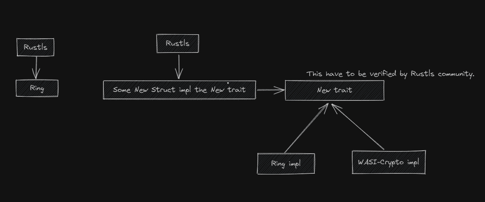

# week-05

反馈 1：选择什么语言方案：rust

我做了以下这些比较。

1. 从基础依赖分析。用 c++ 我认为需要把 openssl 中 libssl 的部分 bind 到 webassembly 然后 rust 用 openssl bind 调用。而采用 rust 的话，wasi-crypto 实现也相对完整，比如 tls1.3 所需要的算法都已经经过了 rust crypto 那边的 test，而 tls1.2 可能薄弱些。如果只支持 tls1.3 的话，开发过程使用 rust 会更加顺利。
2. 从工作量分析。我的的办法就是去 rustls 里面全局搜索一下哪里 use 了 ring 和 webpki 我已经大致搜索过，其实没想象中那么多。rustls 项目本身的代码量在 3w 行左右，ring 可能就 8000 行左右。如果开发者想自己 bind cpp 的 openssl 的话代码量估计也差不多，不过这就是完全自己写（预计万行）。也就是说是 cpp 的代码量上我预计是超越 rust 的。
3. 从调试过程分析。Rust 编译成 wasm 直接在 webassembly 测试上会简单很多，而 host function 的 debug 会麻烦不少。开发者需要 dbg wasmedge 去 run webassemblt file，这不太容易。

C++ 会更加复杂，结合我上次的初步看法，我认为采用 rust 会是更好的选择。

反馈 2：项目设计

我的初步构想如下图所示，但这还不是我最终的版本，因为我能感觉到这样的设计会对上游 rustls 造成比较大的改动，这是具有难度的。

我已经向 rustls 的维护者发送了邮件经行探讨。我预计会对两边都有相当大的好处。

我计划在下周完成更细致的设计，并且得到是 rustls 社区的反馈。
